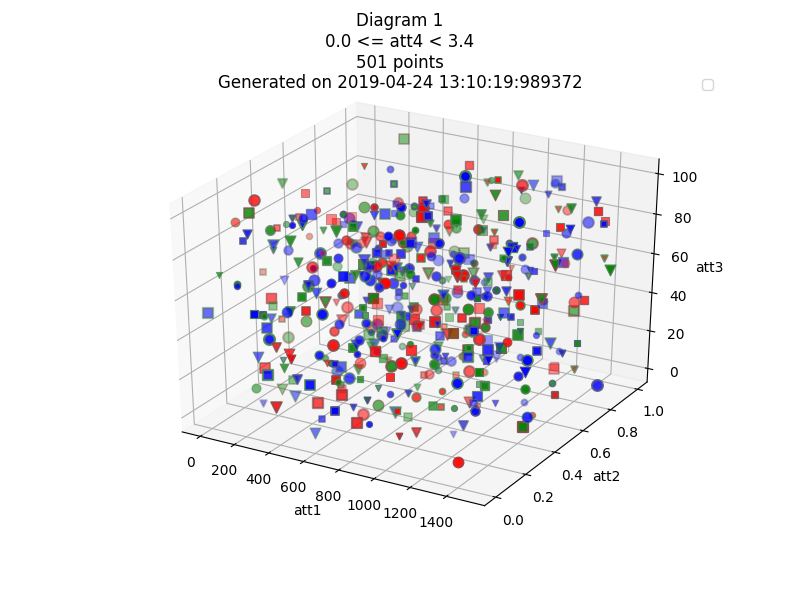
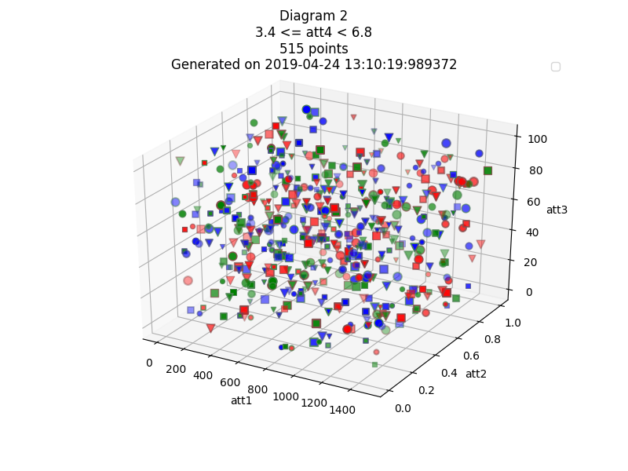
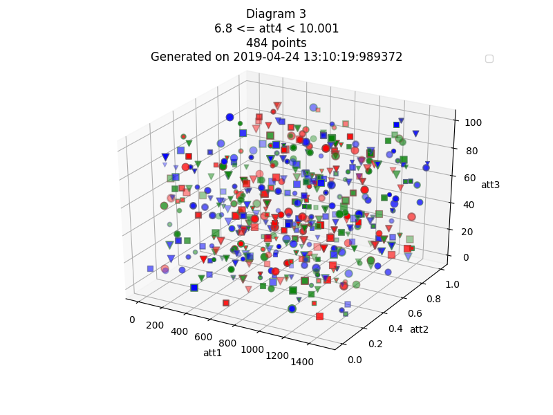

# visuals
Helpful for visualising data (though not easy to interpret by human eyes)

## images




## legends.txt

```
Test conducted on: 2019-04-24 13:10:19:989372
X-axis = 'att1' attribute
Y-axis = 'att2' attribute
Z-axis = 'att3' attribute
There will be 3 diagrams containing all the boundary values of 'att4' attribute generated automatically
Size of the points depends on 'att5' attribute automatically
	If att5.value() < 16.0	then	Point size = 20
	If att5.value() < 23.0	then	Point size = 40
	If att5.value() < 30.0	then	Point size = 60
Color of the points depends on 'att6' attribute automatically
	If att6.value() < 4.0	then	Point color = blue
	If att6.value() < 7.0	then	Point color = green
	If att6.value() < 10.0	then	Point color = red
Color of the point edge depends on 'att7' attribute automatically
	If att7.value() < 31.0	then	color of the point edge = #4d5384
	If att7.value() < 42.0	then	color of the point edge = #4d8453
	If att7.value() < 60.0	then	color of the point edge = #844d4d
Marker of the point depends on 'att8' attribute generated automatically
	If att8.value() < 0.84	then	marker of the point = o
	If att8.value() < 1.19	then	marker of the point = v
	If att8.value() < 1.5	then	marker of the point = s
	Refer to https://matplotlib.org/api/markers_api.html#module-matplotlib.markers to see markers and their respective symbols
Opacity of the point depends on 'att9' attribute. All the values are scaled between 0 (transparent) to 1 (opaque) by dividing all by the MAX value
Width of the point edge depends on 'att10' attribute. All the values are scaled between 0.7 to 1.5
	Refer to the source code to see the formula.

		Images generated successfully!
===================================================================
```